PRATIKUM 11 PEMROGRAMAN WEB

TUGAS INI DIBUAT UNTUK MEMENUHI TUGAS PERTEMUAN 12

NAMA : Mulifatkhul Rachiim

NIM : 312010180

Kelas : TI.20.B1

Langkah Pratikum

Mengaktifkan ekstensi melalui XAMPP Control Panel

selanjutnya, mendownload Codeigniter 4
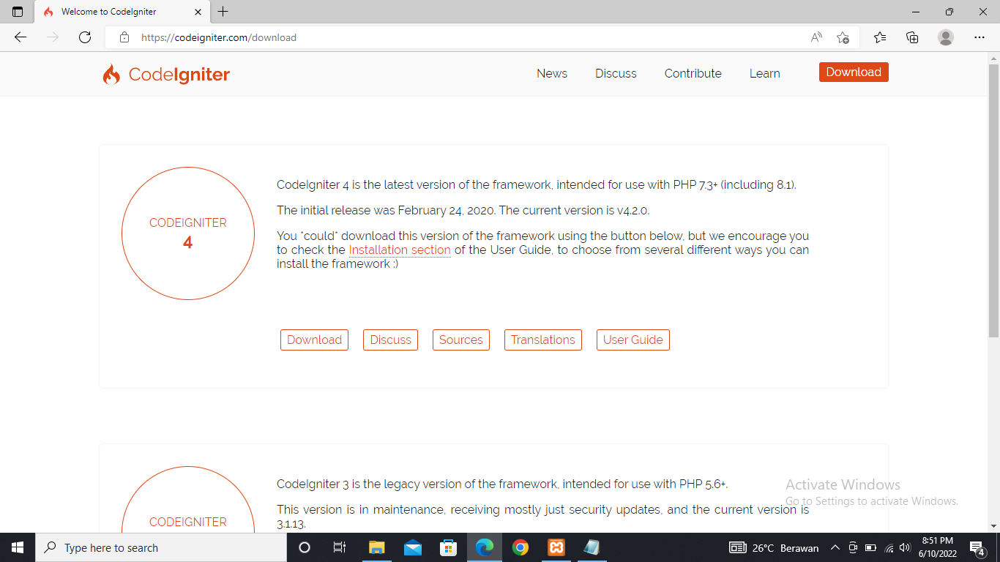

Selanjutnya mumbuat perintah php spark
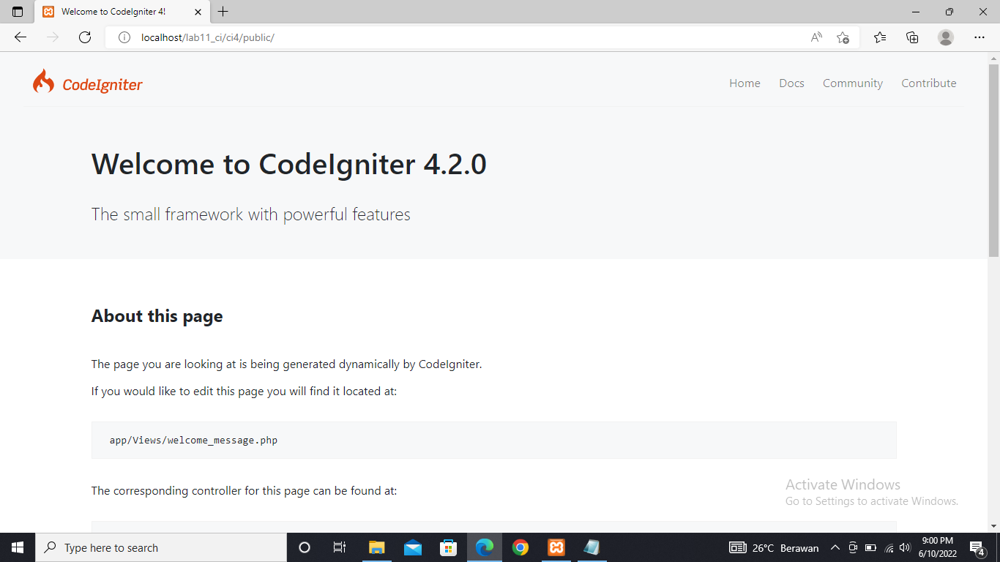

setelah itu refresh kembali laman web
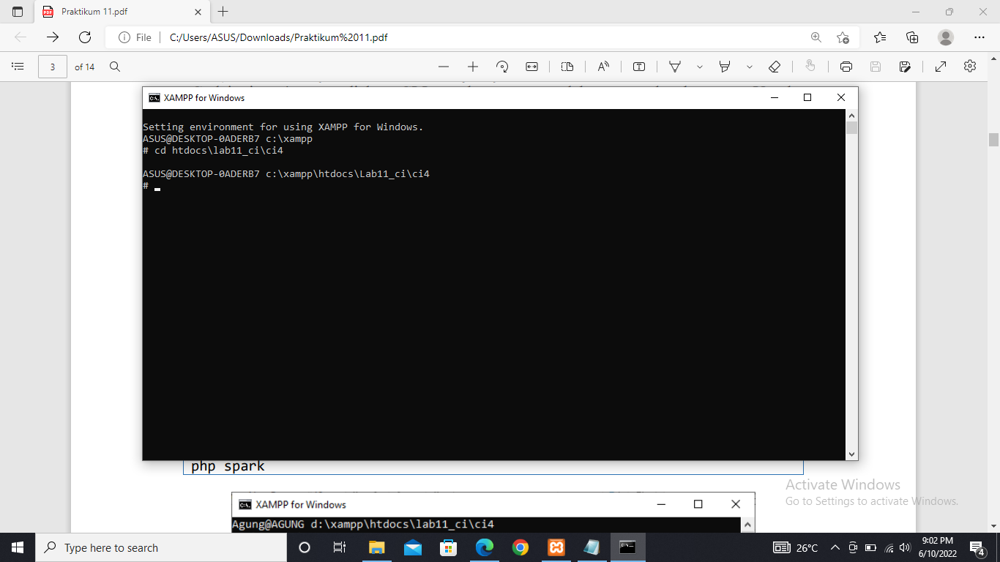

Menampilkan CI_ENVIRONMENT menjadi development
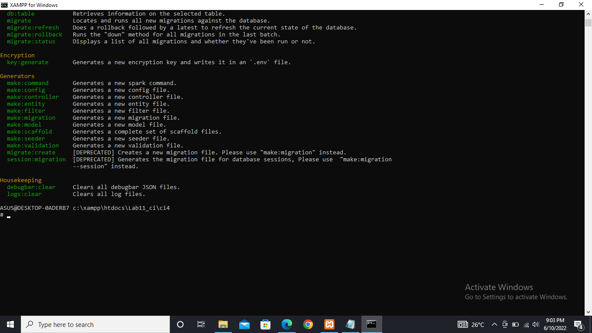

setelah itu refresh kembali laman web
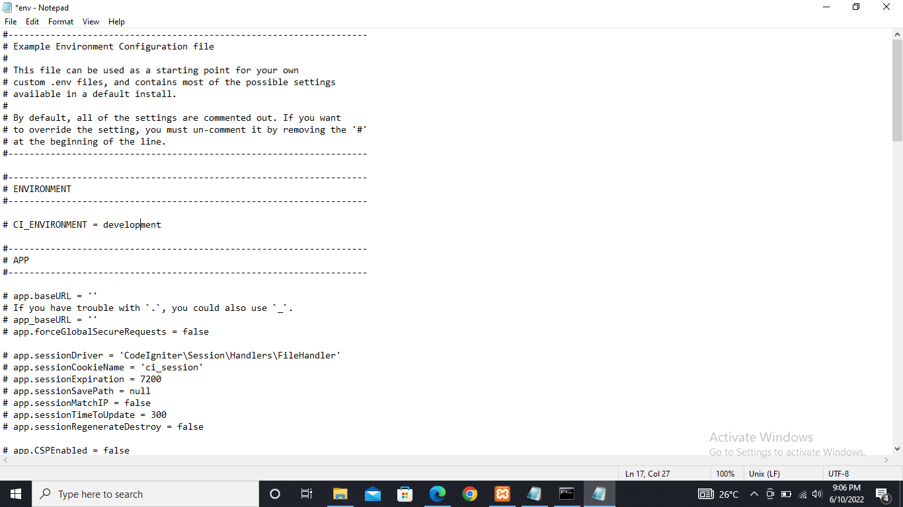

Merubah kode file app/controller/Home.php
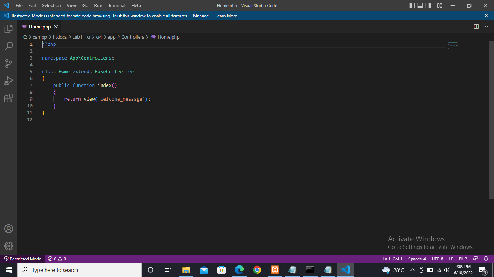

Setelah itu mengganti router pada file app/config/Routes.php
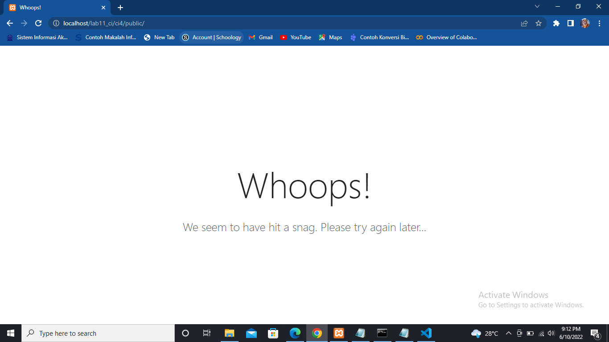
Setelah itu menambahkan php spark routes

lalu refresh kembali pada laman web

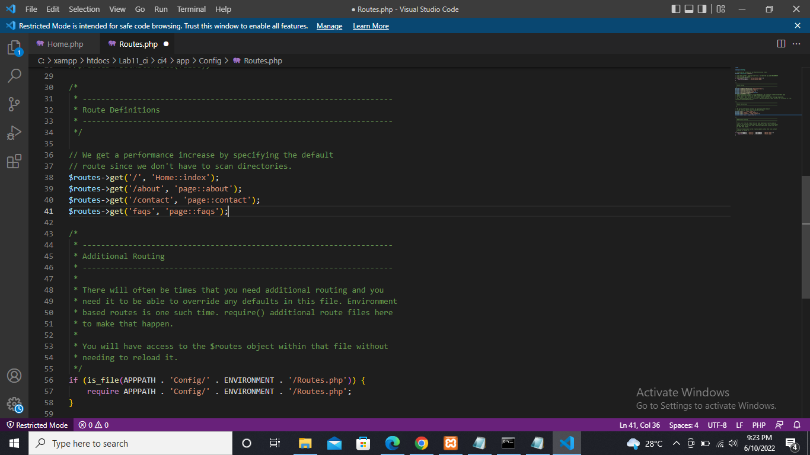

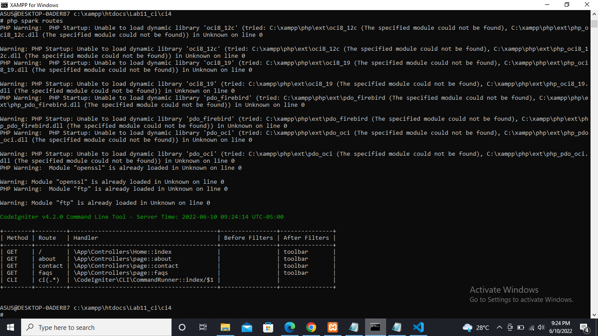

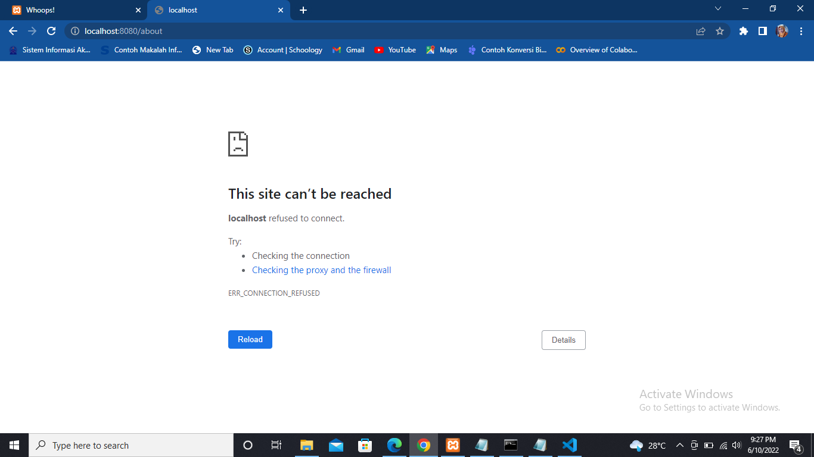

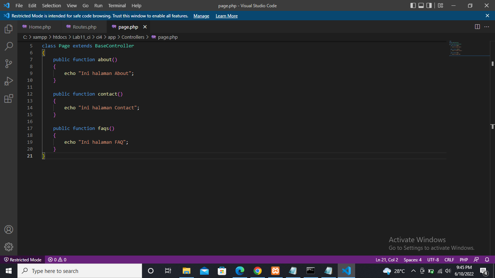

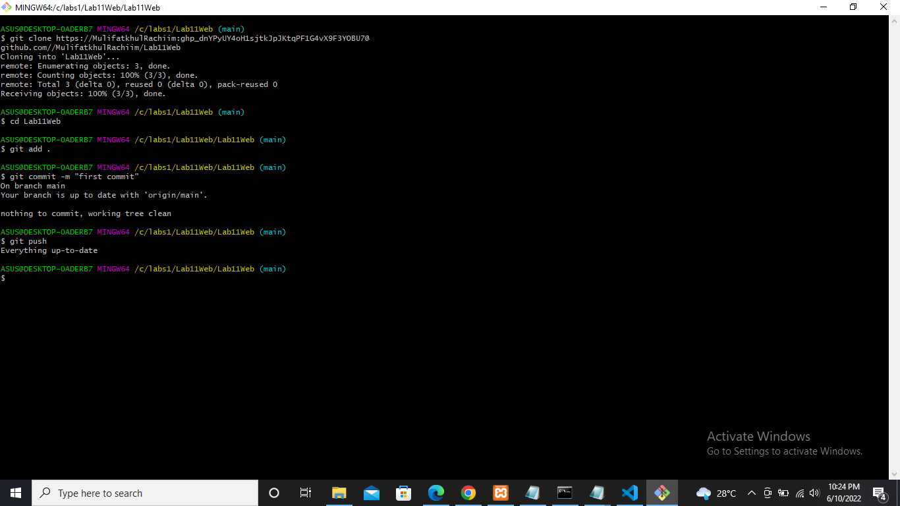

